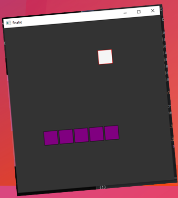
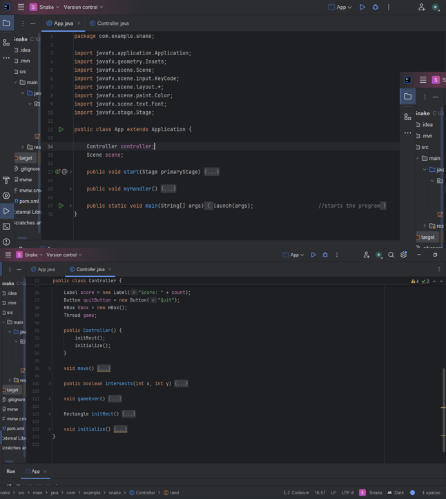

# Snake Game

Ein einfaches 2D-Snake-Spiel, entwickelt mit JavaFX.
Das Ziel des Spiels ist es, die Schlange wachsen zu lassen, indem man das Essen frisst, während man versucht, nicht mit dem eigenen Körper zu kollidieren.

## Inhaltsverzeichnis

- Autor
- Features
- Screenshots
- Voraussetzungen
- Abhängigkeiten
- Projektstruktur
- Lizenz
- Kontakt
- Credits
- Verwendung

## Autor

- **Yasin** - [GitHub-Profil](https://github.com/yasincodes97)

## Features

- Steuerung der Schlange mit den Pfeiltasten
- Kollisionsprüfung mit dem Körper
- Zählung des Scores
- Möglichkeit, das Spiel zu beenden

## Screenshots




## Voraussetzungen

- JDK 11 oder höher
- Maven (wird zur Verwaltung von Abhängigkeiten und zum Bauen des Projekts benötigt)

## Abhängigkeiten

Die Abhängigkeiten werden in der `pom.xml`- Datei verwaltet. Stelle sicher, dass Maven installiert ist, um die Abhängigkeiten automatisch zu verwalten.

## Projektstruktur

- **`App.java`**: Hauptklasse, die die JavaFX-Anwendung startet.
- **`Controller.java`**: Enthält die Logik des Spiels, einschließlich der Bewegungen der Schlange und der Kollisionserkennung.
- **`module-info.java`**: Enthält die Moduldefinition und Abhängigkeiten.

## Lizenz

The Unlicense.
Beiträge sind willkommen!

## Kontakt
Fühle dich frei, Anpassungen oder Anregungen vorzunehmen.
Bei Fragen gerne mich kontaktieren.

## Credits

Ich möchte den folgenden Ressourcen danken, die mir bei der Entwicklung dieses Projekts geholfen haben:

- [JavaFX-Tutorial von Oracle](https://openjfx.io) – Einführung und grundlegende Informationen zu JavaFX.
- [Stack Overflow Thread](https://stackoverflow.com/questions/68125201/stackoverflowerror-java-fx) – für Hilfe bei JavaFX-Syntaxfragen.

## Verwendung

Um das Projekt auf deinem lokalen System auszuführen, klone das Repository mit folgendem Befehl:

```bash
- git clone <https://github.com/yasincodes97/Snake2D.git>
- cd Snake2D
- öffne die IDE deiner Wahl
- importiere das Project
- stelle sicher, dass das Build-Tool (Maven) korrekt konfiguriert ist
- App.java ausführen